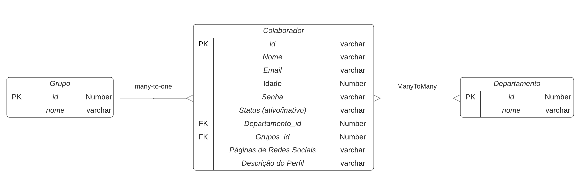

# Desafio_nodejs

O projeto faz parte do pocesso seletivo para Desenvolvedor Node.js Júnior da SigTrans.
O desafio proposto consiste na criação de um WebApp para divulgação do Perfil de
Colaboradores dentro da empresa, onde no escopo inicial precisaremos implementar um CRUD
(Criar /Ler /Modificar /Deletar) de Pessoas (Colaboradores) organizando por Departamentos,
onde poderá ser implementado na empresa para que todos os colaboradores possam ter acesso
ao perfil dos colegas.
# Diagrama de Entidade Relacionamento (DER)
</br>

</br>

 ## 📋 Dependências utilizadas
Dependencias:
- @types/swagger-ui-express 4.1.3
- @types/uuid 8.3.1
-  bcryptjs 2.4.3
- Express 4.17.1
- Postgres 8.7.1
- reflect-metadata 0.1.13
- swagger-ui-express 4.5.0,
 - tsc 2.0.4,
- Typeorm 0.2.34
- uuid 8.3.2

Dependencias de Desenvolvimento:
- @types/bcryptjs 2.4.2
- @types/express 4.17.13
- @types/jest 28.1.6
- jest 28.1.3
- ts-jest 28.0.7
- ts-node-dev 1.1.8
- typescript 4.3.5


## ⚙ ️ Executar

Iniciando o servidor.
```
yarn start
```
**Acesse pelo o projeto endereço http://localhost:300**

Subir o servidor Docker
```
docker-compose up -D
```
Execução das Migrations
```
yarn typeorm migration:generate -n defull

yarn typeorm migration:run
```

## Deploy

Dillinger requires [Node.js](https://nodejs.org/) v10+ to run.

Install the dependencies and devDependencies and start the server.

```sh
cd dillinger
npm i
node app
```

For production environments...

```sh
npm install --production
NODE_ENV=production node app
```

## Serviços da API
Os serviços disponibilizados na API são:

 **SERVIÇO COLABORADOR**

| Serviço | Rota |
| ------ | ------ |
| Criar | [/colaborador][PlDb] |
| Listar Tudo | [/colaborador][PlGh] |
| Listar pelo Nome | [/colaborador/name][PlGd] |
| Atualizar | [/colaborador/id][PlOd] |
| Deletar | [/colaborador/id][PlMe] |

 **SERVIÇO DEPARTAMENTO**

| Serviço | Rota |
| ------ | ------ |
| Criar | [/departamentos][PlDb] |
| Listar Tudo | [/departamentor][PlGh] |
| Atualizar | [/departamento/id][PlOd] |
| Deletar | [/departamento/id][PlMe] |

 **SERVIÇO GRUPO**

| Serviço | Rota |
| ------ | ------ |
| Criar | [/grupos][PlDb] |
| Listar Tudo | [/grupos][PlGh] |
| Atualizar | [/grupos/id][PlOd] |
| Deletar | [/grupos/id][PlMe] |


REQUISITOS DO DESAFIO
[X] Desenho de um diagrama de entidade relacionamento (DER)

[X] Construir um projeto de API em Typescript utilizando de algum framework http, como Express ou NestJS
[X] Utilizar banco de dados relacional (PostgreSQL) para camada de persistência, com solução demapeamento objeto relacional (ORM) Prisma ou Typeorm;
[X] A API implementada deve seguir os padrões REST, utilizando de maneira coesa os verbos: GET (leitura), POST (inclusão), PUT (atualização) e DELETE (exclusão).
[X] A API deve disponibilizar um CRUD das entidades COLABORADORES, GRUPO e DEPARTAMENTO,

DIRERENCIAS PROPOSTO:
[X] Configuração do Swagger para visualização da documentação da API;
[X] Implementar parametrização para realizar filtro de busca na API de leitura utilizando o campo “nome” como cláusula.
[ ] A implementação de teste de unidade (Jest) de alguns métodos
[X] A implementação e preparação do projeto para deploy em container Docker


## License

MIT

**Free Software, Hell Yeah!**

⌨️ by [Pedro Gomes Jr]ttps://gist.github.com/DgSantos017) 😊

[//]: # (These are reference links used in the body of this note and get stripped out when the markdown processor does its job. There is no need to format nicely because it shouldn't be seen. Thanks SO - http://stackoverflow.com/questions/4823468/store-comments-in-markdown-syntax)

   [dill]: <https://github.com/joemccann/dillinger>
   [git-repo-url]: <https://github.com/joemccann/dillinger.git>
   [john gruber]: <http://daringfireball.net>
   [df1]: <http://daringfireball.net/projects/markdown/>
   [markdown-it]: <https://github.com/markdown-it/markdown-it>
   [Ace Editor]: <http://ace.ajax.org>
   [node.js]: <http://nodejs.org>
   [Twitter Bootstrap]: <http://twitter.github.com/bootstrap/>
   [jQuery]: <http://jquery.com>
   [@tjholowaychuk]: <http://twitter.com/tjholowaychuk>
   [express]: <http://expressjs.com>
   [AngularJS]: <http://angularjs.org>
   [Gulp]: <http://gulpjs.com>

   [PlDb]: <https://github.com/joemccann/dillinger/tree/master/plugins/dropbox/README.md>
   [PlGh]: <https://github.com/joemccann/dillinger/tree/master/plugins/github/README.md>
   [PlGd]: <https://github.com/joemccann/dillinger/tree/master/plugins/googledrive/README.md>
   [PlOd]: <https://github.com/joemccann/dillinger/tree/master/plugins/onedrive/README.md>
   [PlMe]: <https://github.com/joemccann/dillinger/tree/master/plugins/medium/README.md>
   [PlGa]: <https://github.com/RahulHP/dillinger/blob/master/plugins/googleanalytics/README.md>
